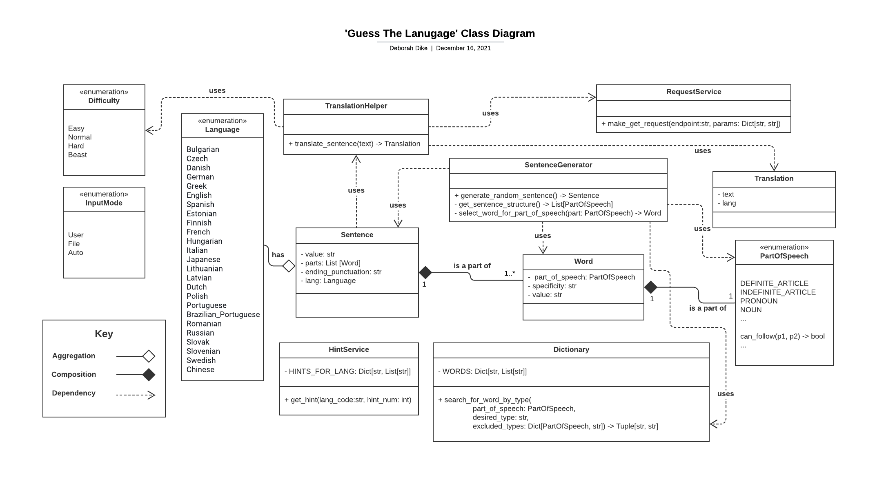
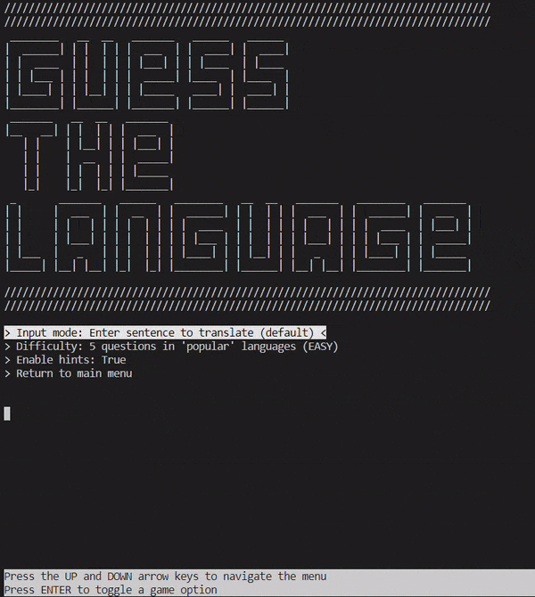
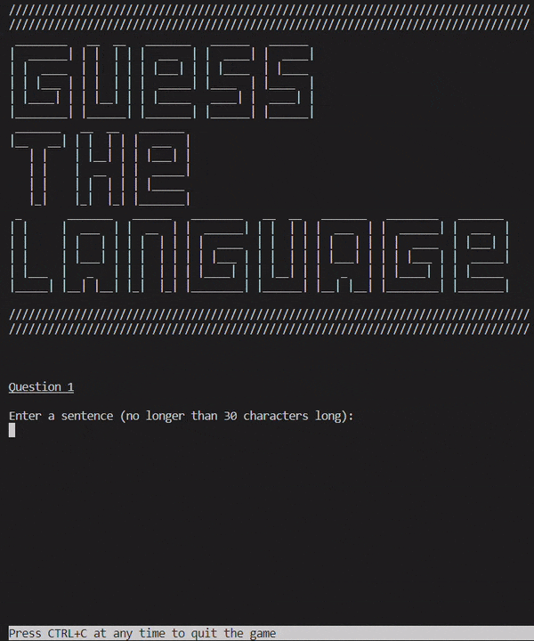
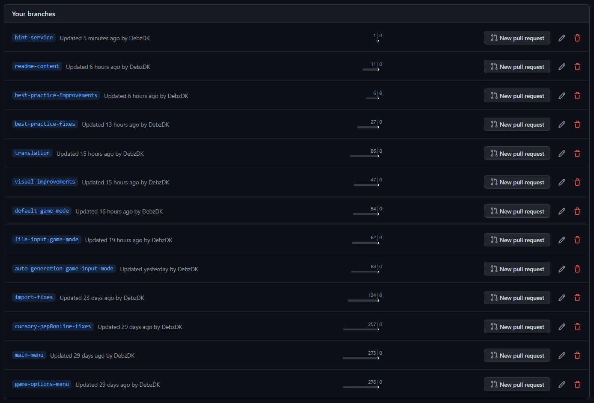

# Guess The Language

'Guess The Language' is a language-guessing game that takes sentences from a .txt file, user input, or auto-generated data and translates them into another language. Its quiz-like fashion aims to introduce people to the beauty of language in a fun way and show how the differences between languages can range from tiny to quite big. The site will be targeted toward people who have an interest in or are curious about languages. This site will also be useful for people who want to see the capability of a translation tool other than Google Translate.


## Requirements

Before jumping into the design process, requirements needed to be specified in order to know exactly what the game should do to meet the assessment criteria.

Unlike the previous portfolio projects, the visual output is simply textual and therefore functionality and flow of events is even more so crucial.

The following functional requirements were decided on:
1. The game must present the user with a logo and/or welcome message.
2. The game must display a navigable main menu.
3. The game must allow a user to choose how they want to play.
4. The game must allow a user to quit the game at any time before the end of the game.
5. The game must display the user's score in the form of: `You guessed {correct_answers}/{total_num_of_questions} correctly!`.
6. The game must display the correct answer after every wrong answer.
7. The game must allow a user to have a total of 3 hints if enabled.

## Design

### Logical flow

[Lucidchart](https://www.lucidchart.com/) was used to illustrate the logical flow derived from the requirements in the form of the flowchart shown below.


### Encapsulation

While implementing the basic functions of the game, it was necessary to start thinking about how to model the various components of the game in order to separate concerns. This was, initially, a difficult task until I remembered a tool that would help with breaking down the processes - a [Unified Modeling Language (UML)](https://en.wikipedia.org/wiki/Unified_Modeling_Language) diagram.

After this brainwave, a structural UML diagram, a.k.a [a class diagram](https://en.wikipedia.org/wiki/Class_diagram#General_relationship), was created as shown below.

Before:


After (doesn't display all private methods due to sheer amount):


### Coding practices

To ensure that the project code is up to standard, the following PEP rules were adhered to:

* [PEP 8 -- Style Guide for Python Code](https://www.python.org/dev/peps/pep-0008/) - for best code style practices (i.e. layout, naming conventions, comments, etc.) and programming recommendations on function and variable annotations
* [PEP 257 -- Docstring Conventions](https://www.python.org/dev/peps/pep-0257/) - for general rules on docstrings
* [NumPy Style Guide](https://numpydoc.readthedocs.io/en/latest/format.html) - for a more detailed explanation of what goes where in docstrings, using [this](https://sphinxcontrib-napoleon.readthedocs.io/en/latest/example_numpy.html) specifically as an example to follow
* [PEP 3107 -- Function Annotations](https://www.python.org/dev/peps/pep-3107/) - for a specific way to specify function information and avoid confusion
* [PEP 484 -- Type Hints](https://www.python.org/dev/peps/pep-3107/) - also for purposes of clarity (although provisional)
* [PEP 526 -- Syntax for Variable Annotations](https://www.python.org/dev/peps/pep-0526/) - also for purposes of clarity

### Planning and execution

Agile practices were used to carry out this project and documented in Trello [planning/design board](https://trello.com/b/JGCCLlNB/project-planning-design) and [dev board](https://trello.com/b/TsXKTw7W/project-development) and [Github Projects](https://github.com/DebzDK/guess-the-language/projects/1).

*Please note that more task details + resources are available in the Trello boards than in the Github Projects page.*

Each board is divided into 3 swimlanes/columns:
* 'To Do' - used to list tasks that are yet to be done
* 'In Progress' - used to list tasks that are currently being carried out
* 'Done' - used to list completed tasks

After defining the status divisions for a task, the indicators for time constraints were defined using 't-shirt sizes'.


‘T-shirt sizes’ were defined to provide an estimate for the perceived difficulty of a task and extra labels to further separate tasks by what part of the process they’re related to, i.e. Requirements, Design, Development, and Testing.
The project area labels have been defined as follows:
* ‘Requirements’ - refers to things that are directly taken from or related to the project’s assessment criteria rather than actions derived from a requirements capture process
* 'Design' - refers to steps taken towards the appearance of the website
* 'Development' - refers to steps taken towards the implementation of the website
* 'Testing' - refers to steps taken towards validating the HTML and CSS as well as testing the responsiveness of the website

At this point, user stories were created in order to produce tasks while thinking from a user's perspective.


All other user stories follow the same kind of format except for where the user story is self-explanatory of the task.

## Features

Each feature listed below was chosen to provide users with a clear, logical path through the application content in order for this project to achieve its goal and its functional requirements.

### Existing features

* Main menu
    * Allows users to see a main menu before starting the game

        

        From here, a user can start the game and view/set game options.
        *Please note: For some reason, the bottom bar does not display in the terminal of the deployed Heroku site. Even after adjusting the terminal dimenstions via the views/index.html file in the project, it can't be viewed. Will display when forked and run in Gitpod.*

* Game options menu
    * Allows users to set options that effect gameplay

        

        * Option 1 - 'Input mode' - controls what mode of input users will use to input sentences into the game.
        * Option 2 - 'Difficulty' - controls the amount of languages (and therefore questions) user will encounter per game.
        * Option 3 - 'Enable hints' - controls where or not users what to receive hints while trying to guess a language.

        The free version of the [DeepL Translator](https://www.deepl.com/en/translator) used in the application has a limit of 500,000 characters per month.
        To account for this in the game and allow a reasonable number of games to be played, the following restrictions for sentence character length and the total number of questions per game mode were calculated as follows:

        * Easy (short questions in 'popular' languages) and normal (reasonable-length questions in less 'popular' languages)
            Number of questions: 5
            Max number of characters per sentence: 30
            Total number of games per day: 20

            Total number of characters per month: 5 * 30 * 20 * daysInMonth = 90k - 93k
        
        * Hard - 10 reasonable-length questions in less 'popular' languages
            Number of questions: 10
            Max number of characters per sentence: 40
            Total number of games per day: 10

            Total number of characters per month: 10 * 40 * 10 * daysInMonth = 120k - 124k

        * BEAST - questions in all available languages in the translation API + 5 seconds to answer question
            Number of questions: 25
            Max number of characters per sentence: 20
            Total number of games per day: 10

            Total number of characters per month: 25 * 20 * 10 * daysInMonth = 144k - 148.8k

        These calculations give max approx. 458.8k (+ 9 easy games = 499.3k) characters to use over the span of the month which is equal to 1.8k - 1.86k (or 1.98k) playthroughs following the given amount of each game mode.
        This is what will be followed when testing the application while in development so that the limit isn't prematurely exceeded.

        Once the maximum number of requests has been reached, the API will return that information in the form of an error message that will then be displayed to users before the game is exited (if playing) or started (if trying to play).

        *Please note: 'popular' languages refers to other European languages that are typically offered as second language options in school and in language learning apps, such as Duolingo.*

* Game
    * Where the magic happens
        * Mechanics

            Once a user starts a game, based on the chosen difficulty level and corresponding character limit (as outlined above), they are either prompted for direct input, file input, or presented with auto-generated sentences as input.
            
            After the appropriate input step is taken, the game proceeds to translating the sentence, presenting it to a user in another language, and prompting the user to take a guess. This repeats until the total number of questions for a game has been reached.

            Finally, a tally of the total number of correct guesses are displayed and the game ends.
            
            The cases are as follows:
            * *User input* - the input is validated per question to ensure it meets the set criteria for translation.

                

            * *File input* - the same is true here but with the extra step of using auto-generated values in addition to those extracted from the file if there aren't enough viable sentences for translation. If there are more lines of text than required in the file, the rest are ignored.
                
                

                Once this type of game is complete the user will be informed that the translations are being written to their file. This was initially supposed to be a future feature but has been implemented as of 16/12/21 for the sake of ensuring that LO7 of the pass criteria has been well met. LO7 of the pass criteria states 'Write code that queries and manipulates data to meet the identified vital project needs'.
                
                

            * *Auto-generated input* - sentences are validated as they're being generated until the right combination of words fits into the character limit.

                

                As you can see, the generated sentences are a little... peculiar but they make enough sense. This feature was included in order to add some complexity to an otherwise fairly simple game.

                The better approach would've been to use my knowledge of Natural Language Programming (NLP) to create and train model for a higher level of accuracy instead of used a fixed dictionary. I chose to use a fixed dictionary because I thought it would take longer to reacquaint myself with NLP and go well beyond the scope of this project.

                Even with this approach, more types of words have been defined in gamedictionary.py than have actually been used due to the complexity of trying to capture the logic of English grammar rules. I have left them in incase I decide to return to this project to finish the madness and to show the assessor how I was thinking.

        * Available translation languages

            As mentioned before, Duolingo was referred to in regards to what could be used to classify 'popular' languages and ultimately was used as a guideline to categorise what languages should play for which difficulty levels:
                

            *Note: Duolingo offers more languages than this. The ones that aren't used in the game have been removed from this image.*
                
            * Easy - Spanish, French, Japanese, German & Italian (5)

            * Normal - Chinese, Russian, Brazilian Portuguese, Dutch & Swedish (5)

            * Hard - Greek, Polish, Danish, Finnish, Romanian, Czech, Hungarian + 3 more languages from the DeepL Translator API (10)

            * Beast - All of the above + the remaining languages from the API (Total = 24)

            *The other languages offered by the API are Latvian, Lithuanian, Portuguese (Portugal), Slovenian, Slovak and English but English has been excluded since that is the language we assume to be translating from.*

### Future features

* Ability for a user to enter text that isn't English

    The default language to translate from is English because that is my first language and the language of the country where I reside. However, I also speak more-or-less fluent French and am learning Greek so it would be cool to use sentences in these languages in the game.

    The chosen API to run translations does have an optional parameter that, when omitted, allows for language detection so it is possible but won't be implemented to avoid more potential bugs to deal with.

* Display of the number of countries in which the translation target language is spoken

    It would be cool to make the game educational by adding a decorator that adds the number of countries where the translation target language is officially spoken after a correct or incorrect answer.

    ```
    You guessed French and the answer was French! French is spoken in approximately [num] countries around the world.
    ```

    Wikipedia has an unofficial public API called ['MediaWiki'](https://www.mediawiki.org/wiki/API:Main_page) and a [wiki](https://en.wikipedia.org/wiki/List_of_languages_by_the_number_of_countries_in_which_they_are_recognized_as_an_official_language) containing this information. The two together, plus some algorithm to extract the desired data for a given language, could've provided this information but it isn't verified and appears to be outdated. I couldn't find another source so I chose not to implement this feature.

* Ability to read out translated sentences

    It would have been pretty fun for the game to also read out the translated sentence as a kind of audio hint for a user while playing the game. This could have been implemented using the [gTTs Python library](https://github.com/pndurette/gTTS) which caters for most of the languages the DeepL Translator API supports.

* ~~Writing sentences and their translations to a new text file or the existing text file (if one is provided)~~

    ~~This would allow for some level of persistence for a user who is genuinely interested in languages to keep a log of their translations.~~

## Languages and technologies used

* Languages
    * [Python](https://en.wikipedia.org/wiki/Python_(programming_language)) - used to create the command line application

* Technologies
    * [EZGIF](https://ezgif.com/) - used to create the GIFs used in this README
    * [Lucidchart](https://www.lucidchart.com/) - used to create a flow chart of the game's processes and a class diagram
    * [DeepL Translator](https://www.deepl.com/en/translator) - used to translate sentences in game
    * [Regex101](https://regex101.com/) - used to test the regular expressions used in game for validation
    * [num2words](https://github.com/savoirfairelinux/num2words#readme) - used library to convert numbers to their word equivalent
    * [prompt-toolkit](https://python-prompt-toolkit.readthedocs.io/en/master/) - used library to make prompts for user input use auto-completion and handle arrow and CTRL keys
    * [Requests](https://docs.python-requests.org/en/latest/) - used library to make HTTP requests to DeepL Translator API
    * [StackOverflow](https://stackoverflow.com/) - used to find answers to coding issues, specifically [how to get coloured text](https://stackoverflow.com/questions/287871/how-to-print-colored-text-to-the-terminal), [understand the python equivalent of getters and setters](https://stackoverflow.com/questions/2627002/whats-the-pythonic-way-to-use-getters-and-setters), [the purpose of \__init__\.py](https://stackoverflow.com/questions/448271/what-is-init-py-for), [how to make an enum in Python](https://stackoverflow.com/a/1695250), and [what the Python equivalent of JavaScript's setTimeout() function is](https://stackoverflow.com/a/15456828)
    * [w3schools](https://www.w3schools.com/) - used to find Python functions to complete tasks, e.g. [learning how to make requests](https://www.w3schools.com/python/module_requests.asp) and [file handling](https://www.w3schools.com/python/python_file_handling.asp)
    * [Trello](https://trello.com/) - used to document planning/design and development project progress and steps
    * [Heroku](https://www.heroku.com/) - used to deploy project
    * [Git](https://git-scm.com/) - used for version control
    * [GitHub](https://github.com/) - used for internet hosting and version control through use of Git
    * [Gitpod](https://gitpod.io/) - used as online IDE for software development
        * The terminal was used to create branchs to work on before merging into the main branch. These branches have been preserved for the sake of the assessment, otherwise they would have been deleted after use.

        

### Rationale for library and API selection
1. [DeepL Translator API](https://www.deepl.com/en/translator)
    This API met the needs of the game perfectly because it's free to use (up to 500,000 characters) and covers a fair amount of languages in order to make this game fun to play.
    
    __Alternatives__
     * [Google Translate's Cloud Translation API](https://cloud.google.com/translate/docs/reference/rest)

        This was a tempting alternative since it's the most popular and used translation tool available but wasn't chosen due to the automatic billing that follows in the case of surpassing its free limit. To overcome this, (Google Translate via RapidAPI)[https://rapidapi.com/googlecloud/api/google-translate1/] was considered but on closer inspection it seemed to have the same issue of automatic billing so was dismissed as an option.

     * [googletrans](https://pypi.org/project/googletrans/)

        This looked like a good alternative for the alternative but due to the below note, an official translation service was preferred.
            

1. [num2words library](https://github.com/savoirfairelinux/num2words#readme)

    This library was used in order to not reinvent the wheel by attempting to implement the desired functionality for this project. It was the first to come up after a quick search and there was no apparent reason not to use. In addition, this library is also able to turn numbers into words in languages other than English which is perfect given that this is a language-guessing game. However, this functionality of the library was not used because all translations are made on the basis that a given sentence is in English.

1. [Requests: HTTP for Humans library](https://docs.python-requests.org/en/latest/)

    This is first thing that comes up when running a Google search for 'python requests'. It's also shown as the [go-to way to make HTTP requests in w3schools](https://www.w3schools.com/python/module_requests.asp) so this is what was used.

1. [Python Prompt Toolkit](https://www.google.com/search?q=python+prompt+for+input+suggestion&rlz=1C1CHBF_enGB848GB848&oq=&sourceid=chrome&ie=UTF-8)

    This library was found after running a [Google search for 'python prompt for input suggestion'](https://www.google.com/search?q=python+prompt+for+input+suggestion&rlz=1C1CHBF_enGB848GB848&oq=&sourceid=chrome&ie=UTF-8) (2nd result) and no further searching was required to be honest. It was perfect for my initial need of [adding auto-completion](https://python-prompt-toolkit.readthedocs.io/en/master/pages/asking_for_input.html#autocompletion) to the user input prompt.

    Subsequently, after taking a deeper look at the documentation, other ways to improve the command line application were found and implemented:
    * [Bottom toolbar](https://python-prompt-toolkit.readthedocs.io/en/master/pages/asking_for_input.html#adding-a-bottom-toolbar) - used to provide some guidance to players on how to navigate through the game menus
    * [Custom key bindings](https://python-prompt-toolkit.readthedocs.io/en/master/pages/asking_for_input.html#adding-custom-key-bindings) - used to enable the use of arrow keys to navigate menus rather then using numbers and CTRL-C to quit the game/program at any point

#### Shortcomings
1. [DeepL Translator API](https://www.deepl.com/en/translator)
    
    * Sadly, the API came with an unexpected, hard to predict bug.

        This image shows an attempt to translate 'Hello, how are you?' from English to Japanese. (Email attachment: api-issue-1.png)
        

        This image shows an attempt to translate 'Hello.' from English too Italian. (Email attachment: api-issue-2.png)
        

    * DeepL support was contacted as soon as the bug was discovered to find out if there was a potential workaround. They replied and suggested making use of the 'source_lang' parameter when making the request to ensure that the translator knows that it's translating from English.

        Email to DeepL support:
        

        Response from email support + attached image:
        
        

    * The code was updated to use the 'source_lang' parameter and no reoccurrences of the bug were spotted again... until the game attempted to translate 'Welcome!' into Japanese.

        Recreation of bug using site's simulator:
        

        Which explains why the support response only contained Italian...
        On the bright side, the issue only seems to occur with one word sentences due to lack of context as was stated by the DeepL support agent. This was verified with another quick test using their simulator, as show below:
        
        

        So to make this bug less likely to appear when playing the game, it is necessary to use more than one word when giving a sentence for translation via user or file input.

1. [Python Prompt Toolkit](https://www.google.com/search?q=python+prompt+for+input+suggestion&rlz=1C1CHBF_enGB848GB848&oq=&sourceid=chrome&ie=UTF-8)

    The bottom toolbar re-renders when navigating through the game menus and progressing from one question to the next in the game, as can be seen in the GIFs in the 'Existing Features' section of this README. It's not great on the eyes but it's a small cost to pay in order to provide meaningful user messages to make the game easier to navigate and play.

    It's [a known issue](https://github.com/prompt-toolkit/python-prompt-toolkit/issues/547) and doesn't seem to be on schedule to be fixed any time soon.

## Testing

Evidence for this section has been placed in its own .md file which can be found [here](https://github.com/DebzDK/guess-the-language/blob/main/TESTING.md).
        
## Deployment

The application was deployed via [Heroku](https://www.heroku.com/) using the steps listed below:

1. In Heroku, click 'New' then 'Create app'.

    

1. Name the app and select your closest region.

    

1. Connect to Github and find the guess-the-language project.

    

1. Set up configuration variables and build packages.

    

1. Choose either 'Enable Automatic Deployments' or 'Deploy' for manual deployments.

    *Note: Automatic deployments were enabled for this project.*

    

The live link can be found here - https://guess-the-language.herokuapp.com/

### Local deployment

Since my work is in a publicly-accesible repository, it can be copied in 3 different ways:

1. Cloning the repository

    <code>git clone https://github.com/DebzDK/guess-the-language.git</code>

1. Forking the repository

    

1. Using Gitpod to create a new workspace for the repository with this button: [](https://gitpod.io/#https://github.com/DebzDK/guess-the-language)

## Credits

### Content

The translations used in this application are thanks to [DeepL Translator](https://www.deepl.com/en/translator).

All other textual content in this application is written in my own words and of my own opinion.

## Acknowledgements

A huge thank you to my secondary school French teacher, Ms. McAlpine, who inspired my love for learning languages and thanks again to my mentor [Tim Nelson](https://github.com/TravelTimN) for his encouragement and constructive feedback!