# Testing

## Validator testing

* PEP8 online
    * Initial cursory testing

        As a person who hasn't used Python in about 7 years, preliminary testing was done while in the early stages of development to better understand what to keep in mind while coding.
        
        Many errors, such as those shown below, were encountered and fixed [here](https://github.com/DebzDK/guess-the-language/commits/cursory-pep8online-fixes):
            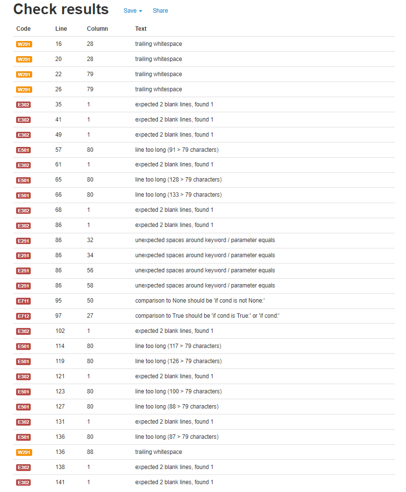
        
        Running the contents of [this](https://github.com/DebzDK/guess-the-language/blob/a5062a6b2b17af2659383b60a67ffa681555073a/run.py) file in the PEP8 online tool will produce the above results.

    * Potential non-error errors
        1. The following errors occur in [run.py](https://github.com/DebzDK/guess-the-language/blob/main/run.py#L157) and [requestservice.py](https://github.com/DebzDK/guess-the-language/blob/main/classes/services/requestservice.py#L17):
            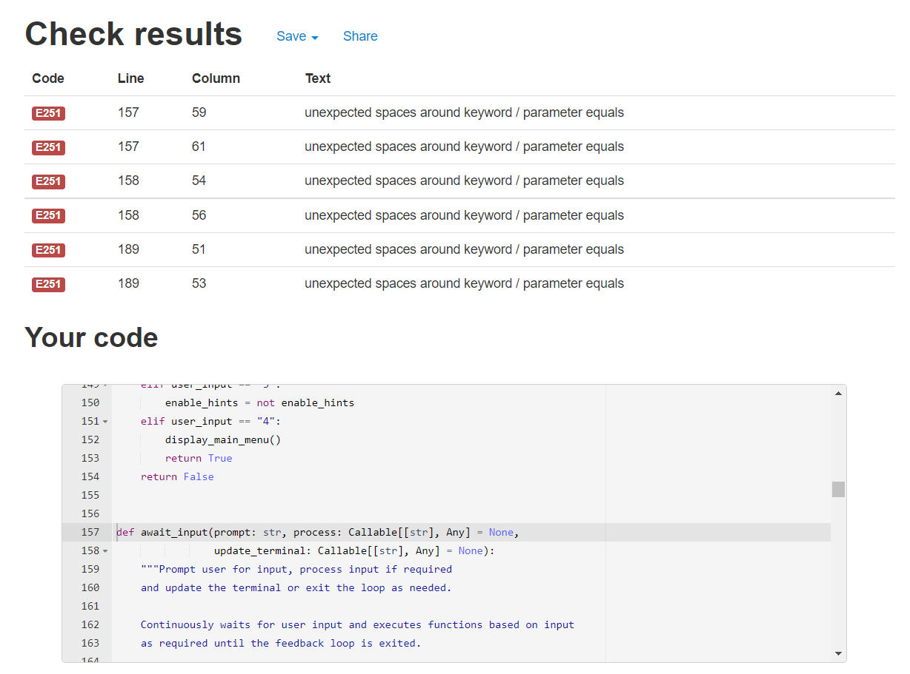
            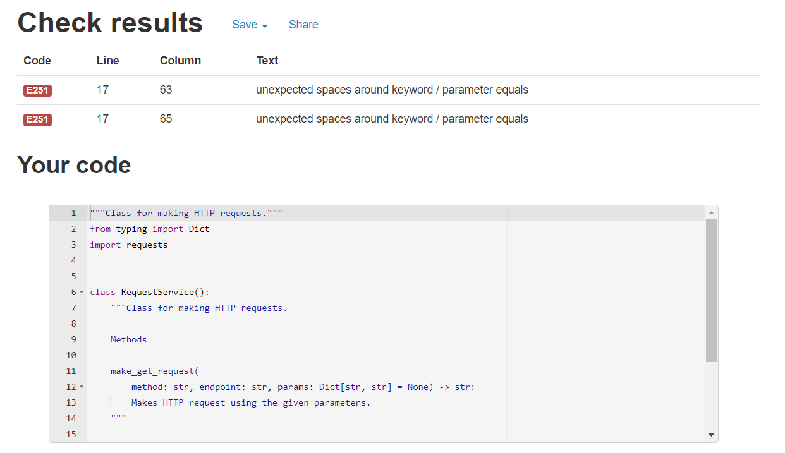

            However, in [PEP 3107](https://legacy.python.org/dev/peps/pep-3107/#syntax), it explains that this is the expected format for funciton annotations that specify a default value and the pystylecode (formerly pep8) tool in Gitpod shows no error on these lines.
            
            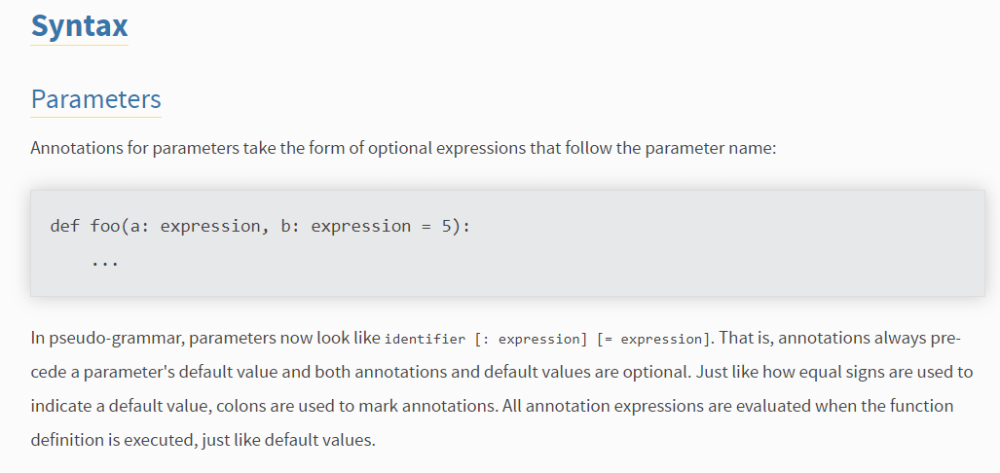
            
            This [answer](https://stackoverflow.com/a/38727786) in StackOverflow also supports this.

            For this reason, these errors outlined by the [PEP8 online tool](http://pep8online.com/) can be ignored.

        2. This error occurred in [gamedictionary.py](https://github.com/DebzDK/guess-the-language/blob/main/classes/gamedictionary.py#L25):
            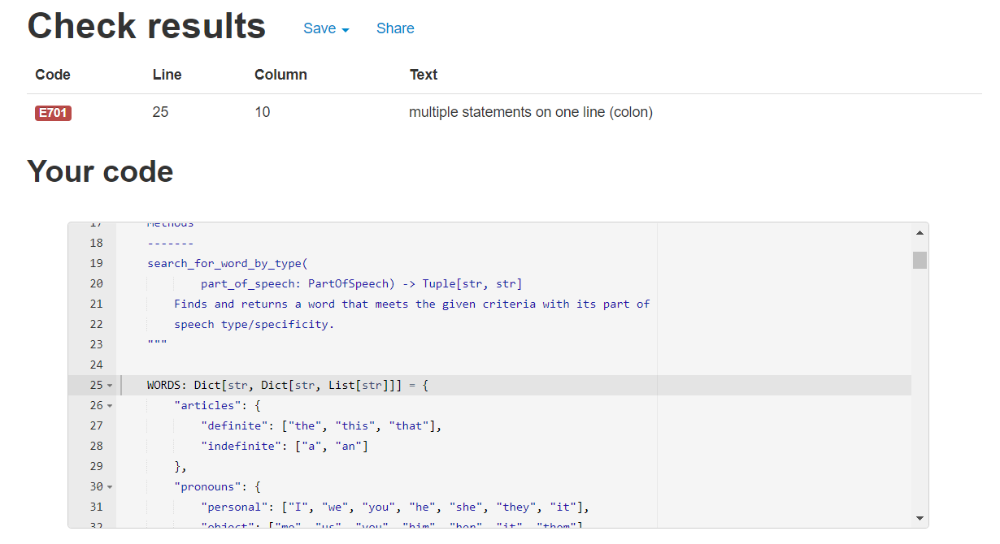

            [PEP 526](https://www.python.org/dev/peps/pep-0526/#class-and-instance-variable-annotations) explains that this is valid form for variable annotations as can be seen here:

            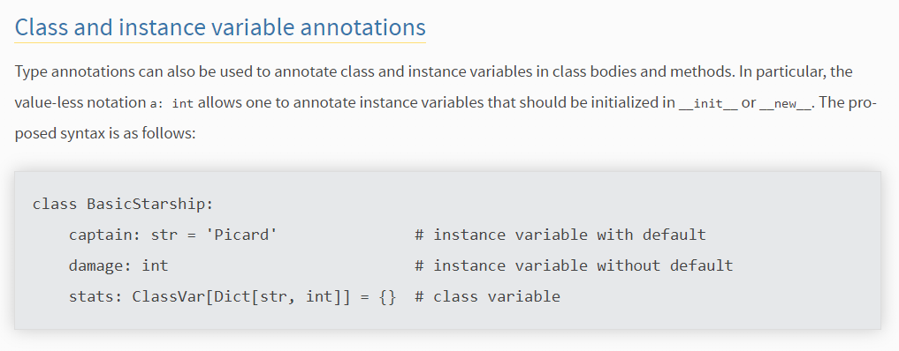

            For this reason, this error can also be ignored.

    * All other classes
        * classes/sentence.py - __Sentence()__
            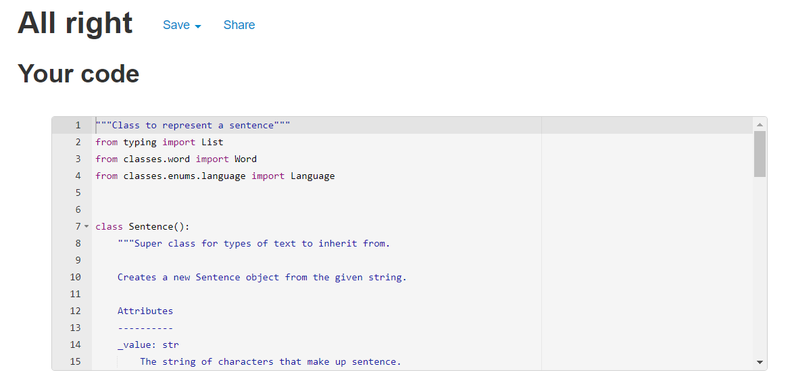
        * classes/sentencegenerator.py - __SentenceGenerator()__
            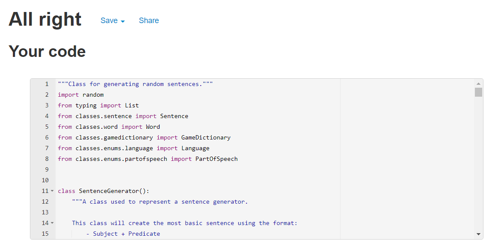
        * classes/translation.py - __Translation()__
            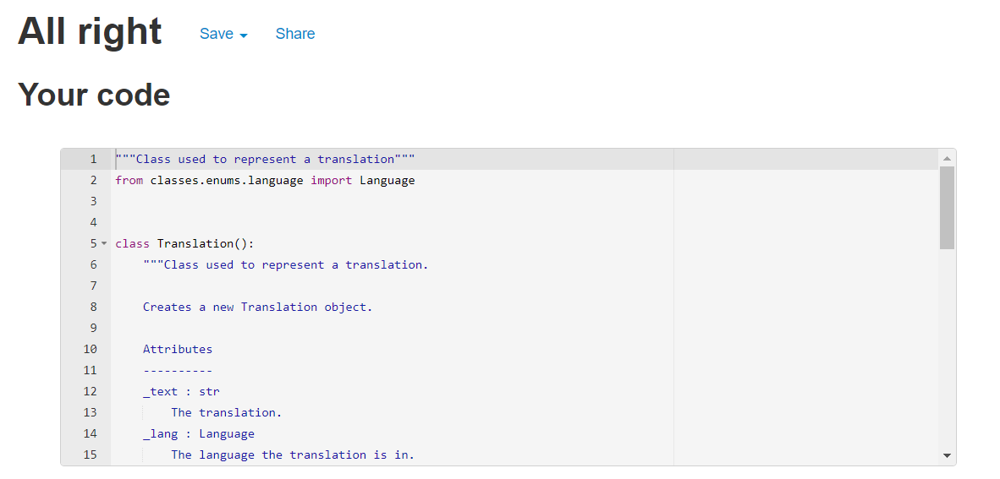
        * classes/word.py - __Word()__
            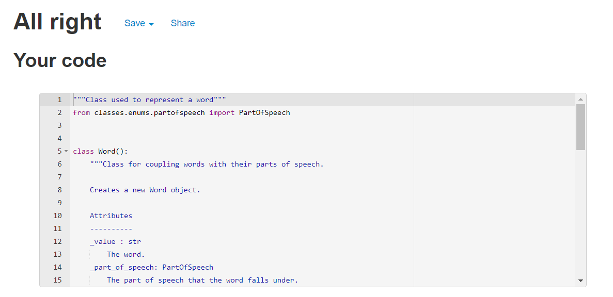
        * classes/enums/difficulty.py - __Difficulty(Enum)__
            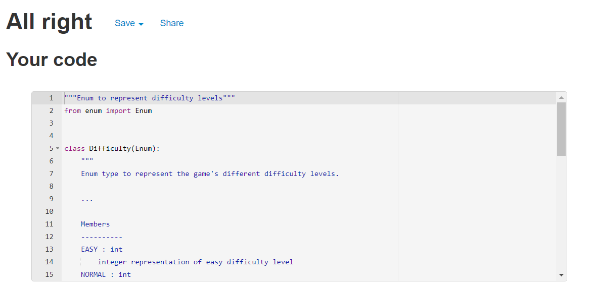
        * classes/enums/inputmode.py - __InputMode(Enum)__
            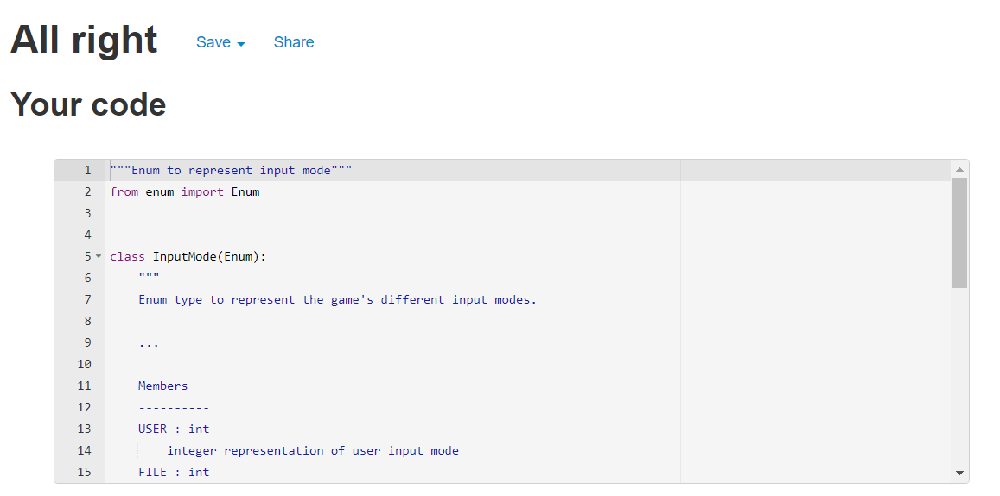
        * classes/enums/language.py - __Language(Enum)__
            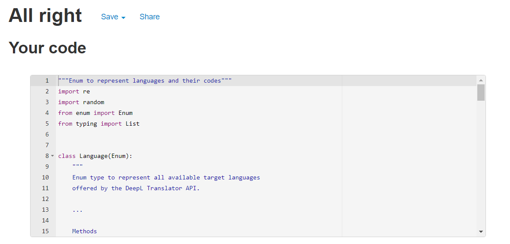
        * classes/enums/partofspeech.py - __PartOfSpeech(Enum)__
            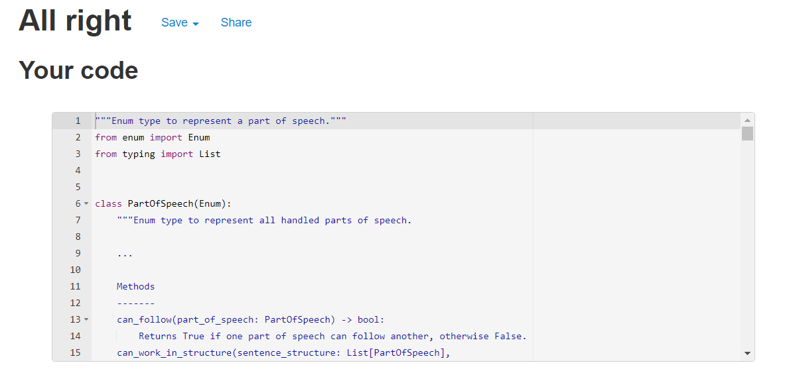
        * classes/helpers/translationhelper.py - __TranslationHelper()__
            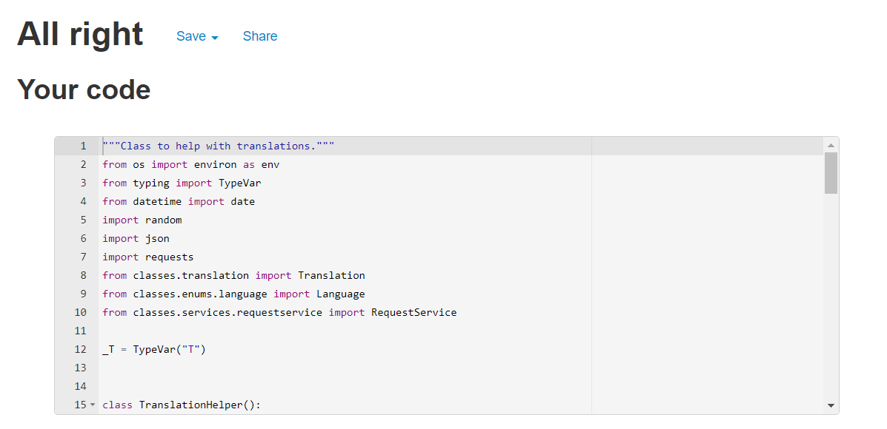