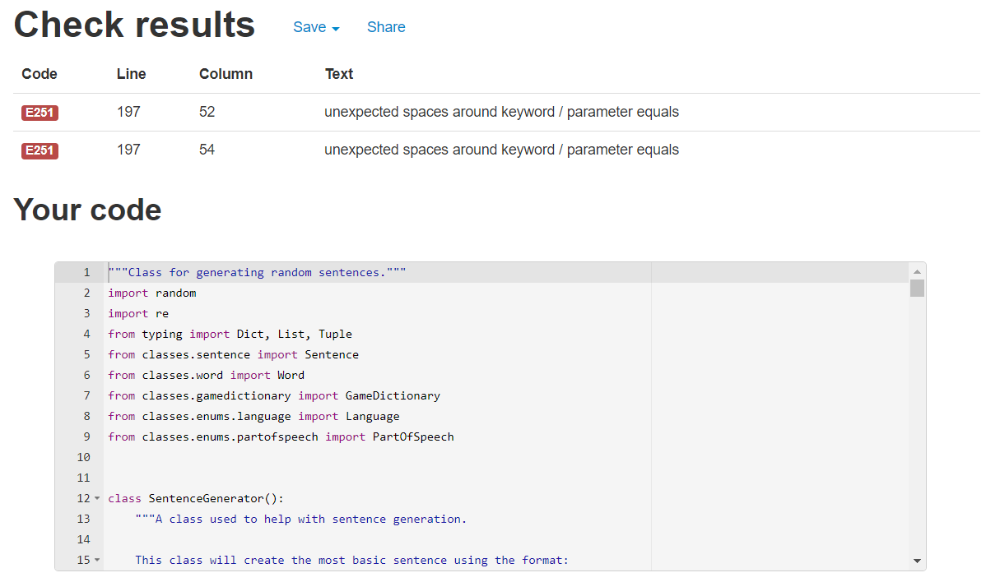
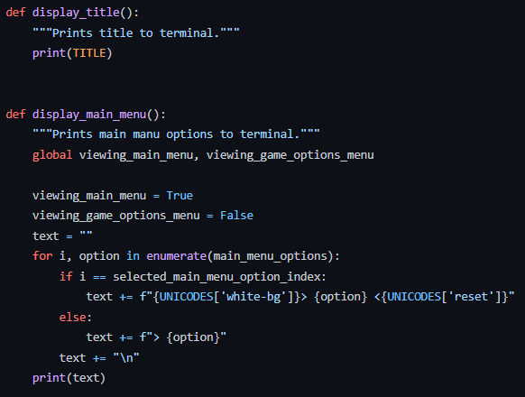

# Testing

## Validator testing

* PEP8 online
    * Initial cursory testing

        As a person who hasn't used Python in about 7 years, preliminary testing was done while in the early stages of development to better understand what to keep in mind while coding.
        
        Many errors, such as those shown below, were encountered and fixed [here](https://github.com/DebzDK/guess-the-language/commits/cursory-pep8online-fixes):
            
        
        Running the contents of [this](https://github.com/DebzDK/guess-the-language/blob/a5062a6b2b17af2659383b60a67ffa681555073a/run.py) file in the PEP8 online tool will produce the above results.

    * Potential non-error errors
        1. The following errors occured in run.py, [requestservice.py](https://github.com/DebzDK/guess-the-language/blob/main/classes/services/requestservice.py#L20), and [sentencegenerator.py](https://github.com/DebzDK/guess-the-language/blob/main/classes/sentencegenerator.py#L178):
            
            
            

            However, in [PEP 3107](https://legacy.python.org/dev/peps/pep-3107/#syntax), it explains that this is the expected format for funciton annotations that specify a default value and the pystylecode (formerly pep8) tool in Gitpod shows no error on these lines.
            
            
            
            This [answer](https://stackoverflow.com/a/38727786) in StackOverflow also supports this.

            For this reason, these errors outlined by the [PEP8 online tool](http://pep8online.com/) can be ignored.

            The code causing this error in run.py has now been removed because it is no longer needed. Here is the updated test result as of 16/12/21:

            

        2. This error occurred in [gamedictionary.py](https://github.com/DebzDK/guess-the-language/blob/main/classes/gamedictionary.py#L25) and [hintservice.py](https://github.com/DebzDK/guess-the-language/blob/main/classes/services/hintservice.py#L23):
            
            

            [PEP 526](https://www.python.org/dev/peps/pep-0526/#class-and-instance-variable-annotations) explains that this is valid form for variable annotations as can be seen here:

            

            For this reason, this error can also be ignored.

    * All other classes
        * classes/sentence.py - __Sentence()__
            
        * classes/translation.py - __Translation()__
            
        * classes/word.py - __Word()__
            
        * classes/enums/difficulty.py - __Difficulty(Enum)__
            
        * classes/enums/inputmode.py - __InputMode(Enum)__
            
        * classes/enums/language.py - __Language(Enum)__
            
        * classes/enums/partofspeech.py - __PartOfSpeech(Enum)__
            
        * classes/helpers/translationhelper.py - __TranslationHelper()__
            

## Testing for user stories

Throughout the design and development of this project, users stories were made to document the process.
Here are some examples to show how user stories were tested in order to determine if the story had been achieved/completed.

*Note: all users stories for design can be found [here](https://trello.com/b/JGCCLlNB/project-planning-design) and development can be found [here](https://trello.com/b/TsXKTw7W/project-development).*

### Design
1. The first user story was simple: 'As a designer, I want to brainstorm what I want my command line application to be.'

    After the initial project meeting with my mentor, it was clear that all of the ideas were well over the scope of this portfolio project and would be better saved for another. However, it still counted and evidence to show that it was completed was attached. 

    
    

1. Once the idea set in stone, the following user story was required: 'As a designer, I want to create requirements in order to ensure that project goals are met.'

    Without this step, it would've been impossible to work out how exactly to reach the goal of this project.

    
    

    Which leads us nicely onto the 'real' testing; development.

### Development
1. The first thing to do was to create what the user would see before they start the game, i.e. a main menu, so the user story was: 'As a user, I want to see the game title and a main menu.'

    
    
    
    

    *Note: I know that not all user stories contain a general idea of tasks to complete as opposed to concrete code but I sometimes think of functions when coming up with ideas and run with it.*

2. The next easy thing to do was to make it possible to get into and out of the 'GAME OPTIONS' menu and make the options within toggleable, so the user stories were as follows:

    
    
    
    

    Old navigation (which matches the descriptions given in the above user stories):
    

    Updated navigation (less jumping about thanks to use of prompt-toolkit library):
    

    *Note: Tasks are broken down into smaller tasks to help see the bigger picture and to not overwhelm myself by trying to tackle everything at once.*

1. After that, the next best thing to do was start with the simplest mode of gameplay: user input.
    The user story was as follows: 'As a user, I want to be able to provide text input to play the game with.'

    However, translation would come much later. All that was required was to prompt the user for a sentence as many times as was required for a given difficulty level. No screenshot was taken of this in its simplest form but its final form, with translation, can be seen below alongside commits for when its simplest form was made:

    
    
    Commits can be seen [here](https://github.com/DebzDK/guess-the-language/commits/default-game-mode?after=18643a8928ae0964816f072bc7dd05ac5a3af653+209&branch=default-game-mode).

    
